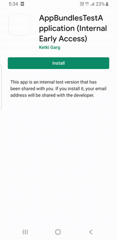

# **Run project with Gradle**
1. **Apk**
    - ./gradlew installDebug
    - Installs the debug app
    - Path to Debug apk: /app/build/outputs/apk/app-debug.apk

2. **Aab**
    - ./gradlew bundleDebug
    - Creates the debug bundle
    - Path to Debug aab: /app/build/outputs/bundle/debug/app.aab

# **Setup Buck project**
1. Follow instruction provided in https://github.com/uber/okbuck link
2. After applying the plugin, you will see okbuck tasks added. To verify run ./gradlew tasks
3. To create buck wrapper execute the task: ./gradlew :buckWrapper
    - This will generate BUCK file in app package
4. Execution of buck tasks will fail at multiple points: ./buckw build //app:bin_debug

    Error 1:
    ```
    > Task :app:okbuck FAILED
    
    FAILURE: Build failed with an exception.
    What went wrong:
    Execution failed for task ':app:okbuck'.
    > /Users/ketkigrag/.android/debug.keystore must be located inside /Users/ketkigrag/App_Bundles/AppBundlesProject
    
    Add signing configuration in app -> build.gradle and create a keystore
    ```
    Error 2:
    ```
    * What went wrong:
    Execution failed for task ':app:okbuck'.
    > Configuration with name 'buckLint_deps' not found.
    
    Add following code to main build.gradle
    okbuck {
            target = "android-$compileSdkVersion"
            buildToolVersion = "28.0.3"
    
            lint {
                disabled = true
            }
    }
   ```
   
# **Run project with Buck**
1. **Apk**
    - ./buckw install //app:bin_debug
    - Installs the debug app
    - Path to Debug apk: /buck-out/gen/app/bin_debug.apk

2. **Aab**
    - Add custom rule
        ```
        ruleOverrides {
                override{
                    nativeRuleName = "android_binary"
                    importLocation = "//buck-rules:BUNDLE_RULE"
                    newRuleName = "original_android_binary"
                }
            }
         ```
    - ./buckw build //app:bundle_debug
    - Creates the debug bundle
    - Path to Debug aab: /buck-out/gen/app/bundle_debug.aab

_There is an issue with the file extension, bundle will show name with .apk instead of .aab.
To fix it, add latest buck version in the build.gradle file:_
`buckBinary = "com.github.facebook:buck:e1fec3196532dc58cf06461ac0f3020f63f570bc@pex"`

# **Use Bundletool to generate apk from aab**
- Generate Universal mode apk
    - ./gradlew bundleDebug **OR** ./buckw build //app:bundle_debug
    - cd libs
    - bundletool build-apks --mode=universal --bundle ../app/build/outputs/bundle/debug/app.aab --output ~/Desktop/app.apks
    - bundletool install-apks --apks ~/Desktop/app.apks
- Refer other bundletool commands https://github.com/google/bundletool

# **Project Details on playstore**
- Play store App URL: https://play.google.com/store/apps/details?id=com.ketkigrag.androidappbundles
- Opt-in URL for Internal test track: https://play.google.com/apps/internaltest/4700301388081364543


